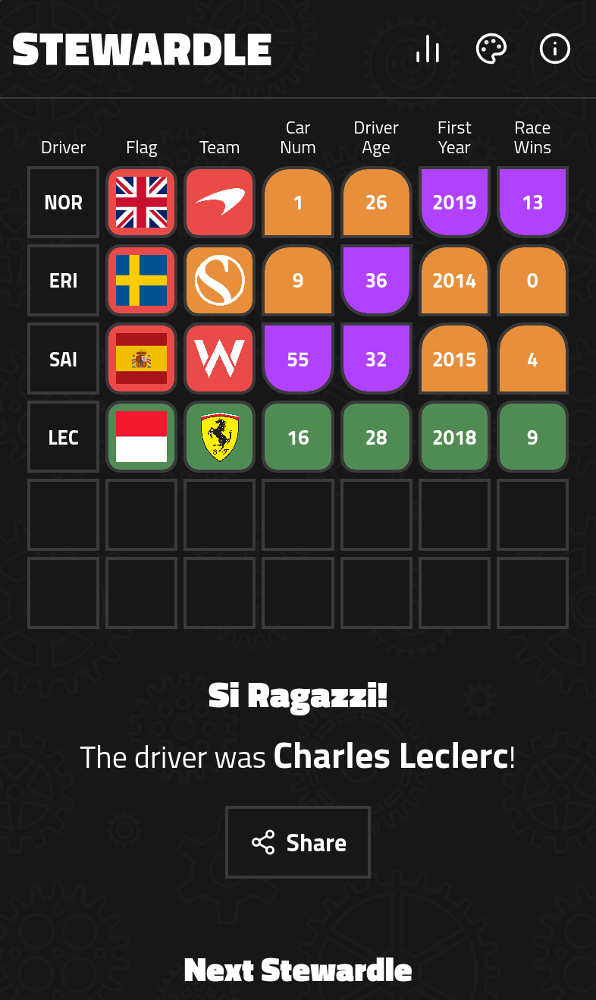

<div align="center">
  
  <h1>Stewardle</h1>
  <p>A daily Wordle-style game for Formula 1 fans: guess the Driver of the Day in six tries.</p>
  <p>
    <a href="https://stewardle.com/">Play</a> ·
    <a href="https://github.com/ssyyhhrr/stewardle/issues">Report a bug</a>
  </p>
  <p>
    <a href="https://github.com/ssyyhhrr/stewardle/actions/workflows/ci.yml"></a>
    <a href="https://hub.docker.com/r/syhr/stewardle"></a>
    <a href="LICENSE"></a>
  </p>
</div>



## How to play

Every day at midnight UTC a new driver is picked from everyone with a permanent
car number (anyone who has raced in F1 since 2014). Type a name, pick it from
the list and each clue tile tells you how close you are:

- **Flag.** Green for the same nationality.
- **Team.** Green for the same current team, orange if the answer used to drive
  for your guess's team.
- **Car number, age, first year and race wins.** Green if equal, otherwise an
  arrow pointing towards the answer.

Win within six guesses to keep your streak, then share the emoji grid. The full
rules are in [docs/spec.md](docs/spec.md).

<br clear="right">

## Running it

You need **Node 24** or newer.

```sh
npm ci
npm run dev          # API server on :3000 plus Vite on :5173 (open that one)
```

The server fetches driver data from [Jolpica](https://github.com/jolpica/jolpica-f1)
on first start (about ten seconds). To work offline, serve the recorded API
responses instead:

```sh
npm run fake-jolpica &    # http://127.0.0.1:4010/ergast/f1
JOLPICA_BASE_URL=http://127.0.0.1:4010/ergast/f1 npm run dev
```

Game state goes to `./data` (see `DATA_DIR`). Delete it to start over.

## Testing

```sh
npx playwright install --with-deps chromium webkit   # once
npm test             # everything: format, lint, typecheck, unit + integration, build, end-to-end
```

Or one piece at a time:

| Command                                 | What it runs                                                              |
| --------------------------------------- | ------------------------------------------------------------------------- |
| `npm run lint` / `npm run format:check` | ESLint (strict, type-aware) / Prettier                                    |
| `npm run typecheck`                     | `tsc` and `svelte-check`                                                  |
| `npm run test:unit`                     | Vitest: the game rules and the server API, with coverage of `src/core`    |
| `npm run build && npm run test:e2e`     | Playwright: the real game in Chromium and WebKit, phone and desktop sizes |

The tests never touch the network. They replay real Jolpica responses recorded
in `tests/fixtures/`, which `npm run fixtures` refreshes (worth doing at the
start of a season). `npm run fixtures:legacy-storage` re-records what the
original site stored in players' browsers, for the migration tests.

## Deploying

CI publishes a Docker image, `syhr/stewardle`, on every push to `main` once the
`DOCKERHUB_USERNAME` and `DOCKERHUB_TOKEN` repository secrets are set.

```sh
docker run -d -p 3000:3000 -v stewardle-data:/data --restart unless-stopped syhr/stewardle
```

Put it behind a reverse proxy for TLS, keep `/data` on a volume and back up
`history.json`. [docs/runtime.md](docs/runtime.md) has the full contract:
environment variables, data files, ports, health check, logs and the
first-boot behaviour.

## How it's built

TypeScript throughout: a [Hono](https://hono.dev) server and a
[Svelte 5](https://svelte.dev) page, both built with Vite, sharing one set of
pure game-rule functions.

```
src/
  core/      the rules as pure functions: days, roster, clues, daily pick,
             game session, stats, share text, search, save format, API types
  server/    Hono app: routes, game service, signed tokens, JSON storage,
             Jolpica client, startup and the nightly refresh
  client/    Svelte app: components, the game controller, styles,
             public/ (flags, logos, icons, manifest, service worker)
tests/
  e2e/       Playwright specs and the page object
  support/   fake Jolpica server, app launcher, fixture loaders
  fixtures/  recorded Jolpica responses and original-site localStorage
scripts/     fixture recorders, icon renderer, dev runner, fake Jolpica
docs/        spec.md (what the game does), runtime.md (how to run it)
```

The server scores every guess and signs each player's progress into a token,
so the answer is never sent to the browser before the game ends.

### Adding a team logo

Save it as `src/client/public/logos/<team>.webp`. The team id is the one in
`src/core/teams.ts`, or the Jolpica `constructorId` for a team the table
doesn't list. Until then the tile shows a text badge.

## Credits

- Inspired by [Wordle](https://www.nytimes.com/games/wordle/index.html).
- Driver data from [Jolpica F1](https://github.com/jolpica/jolpica-f1).
- Flags from [flag-icons](https://github.com/lipis/flag-icons) (MIT, licence
  in `src/client/public/flags/`).
- Icons from [Lucide](https://lucide.dev) (ISC).
- Type is [Titillium Web](https://fonts.google.com/specimen/Titillium+Web) (SIL
  Open Font License).
- Team logos and names are trademarks of their owners; Stewardle is an
  unofficial fan project, not associated with Formula 1 or any team.

## Licence

MIT. See [LICENSE](LICENSE).

Created by Rhys Bishop ([syhr](https://sy.hr/)), mail@rhysbi.shop.
